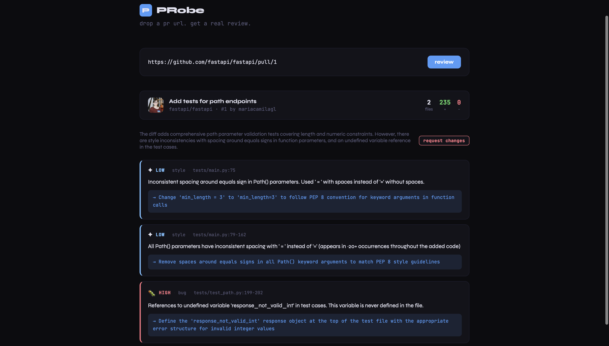

# PRobe

AI-powered code review agent that analyzes GitHub PRs and surfaces bugs, security issues, and performance problems instantly.



## what it does

Drop in a GitHub PR URL and get back a structured code review in seconds. PRobe fetches the diff, runs it through Claude, and returns categorized findings with severity ratings and fix suggestions.

## stack

- **backend** -- FastAPI, Python 3.11, Anthropic API
- **frontend** -- React, Vite

## running locally

**backend**

```bash
cd backend
python3.11 -m venv venv
source venv/bin/activate
pip install -r requirements.txt
echo "ANTHROPIC_API_KEY=your-key-here" > .env
./venv/bin/python3.11 -m uvicorn main:app --reload
```

**frontend**

```bash
cd frontend
npm install
npm run dev
```

Then open http://localhost:5173 and paste any public GitHub PR URL.

## features

- fetches real PR diffs from GitHub's API
- structured review with bugs, security, performance, and style findings
- severity levels (high / medium / low) with file + line references
- PR metadata header showing title, author, files changed, additions and deletions
- loading skeleton while review is being generated

## example

```
https://github.com/fastapi/fastapi/pull/1
```
